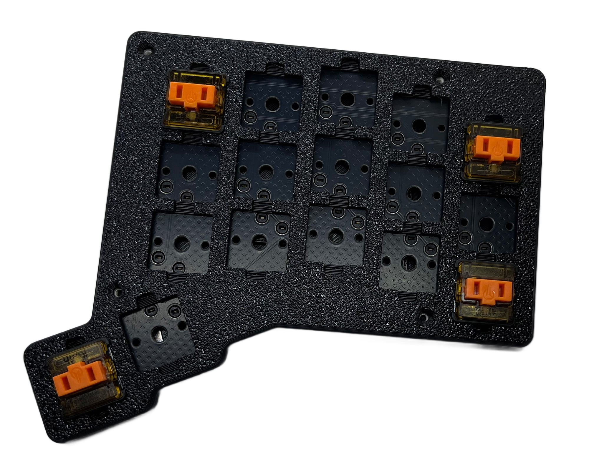

# Forager Build Guide

## BOM

### Parts included in the kit

| Part name | Qty | Remarks |
| :-------- | :-- | :------ |
|           |     |         |

### Additionally required parts

## Battery

You need a Lipo 3.7V (1 cell) battery.

The board has a JST ACH connector or if your battery does not have the right connector, your can solder the two cable direct on the PCB.

- [ ] Add an image with cables solder to the PCB (polarity important)

### Where to buy

- [Aliexpress Lipo 120mAh with JST ACH connector](https://s.click.aliexpress.com/e/_EuJ4GwD)

## Screws

Use a Phillips screwdriver of the most appropriate size to avoid damaging the screw.  
I have found a PZ1 to work well.  
Tighten the screws carefully, they are made of soft metal.  
The set includes some spare screws.

## Assembly

1. Check that you have all required parts
    - [ ] Image with all parts
2. Attach or solder the battery cable to the PCB and secure the battery with the double-sided adhesive tape.
3. Insert the PCB into the bottom of the case. Start with the USB connector and then push the overlying side down. Tighten the 5x screws. Ensure that the battery cable is not trapped between the case and the soldering nut.
4. Place the top plate on the on PCB.  
    Take a choc v1 switch and check that the 2 metal pins are straight.  
    

    Check the orientation before inserting the switch. Insert the switch into one of the outer cut-outs.
      
5. Repeat the last step for the remaining 3 outer switch cut-outs and then proceed with the remaining switch cut-outs.
    This will align the top plate in the correct position.
    
6. Screw the 4x screws into the top plate.

## Typing Test

With Forager fully assembled, it's time to test it out!

### Default keymap

The Forager ships with the following default keymap:

*Keymap image created with [keymap-drawer.streamlit.app](<https://github.com/caksoylar/keymap-drawer https://keymap-drawer.streamlit.app>)*

### Wireless

ZMK will automatically start advertising to allow new hosts to connect. From your computer, go to the bluetooth preferences and add a device. You should see a device named "Forager" in the list. Click that item to connect. Once connected over bluetooth, you should be able to start typing.

To use more than one host/device with you Forager, you'll need to use different profiles to manage the connection/communication with each device. To learn more, read up on ZMK's [bluetooth feature](https://zmk.dev/docs/features/bluetooth).
